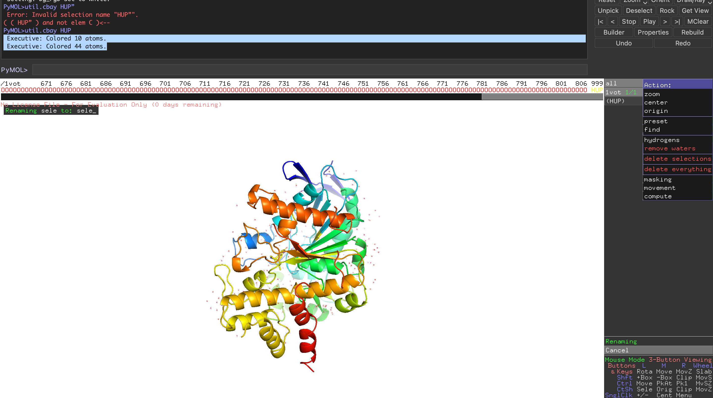
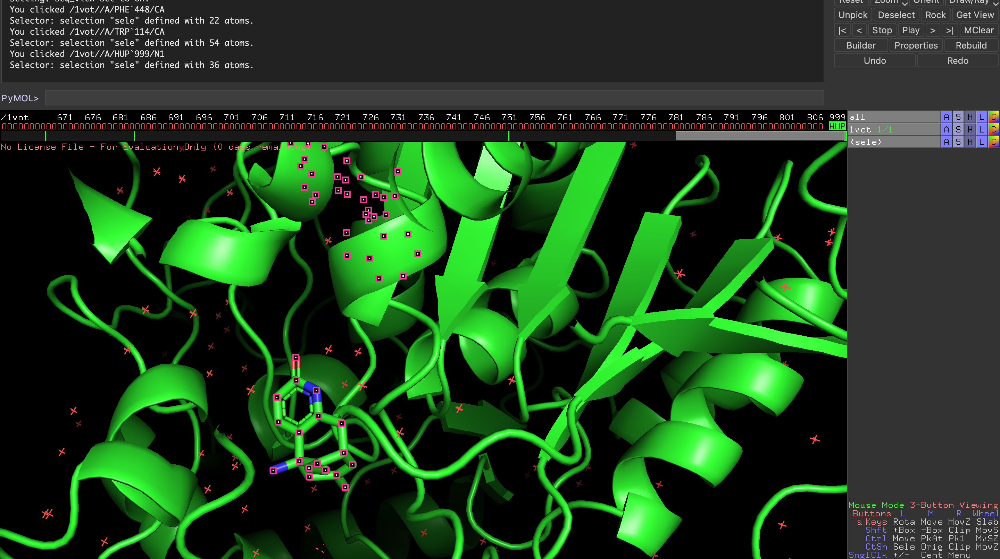
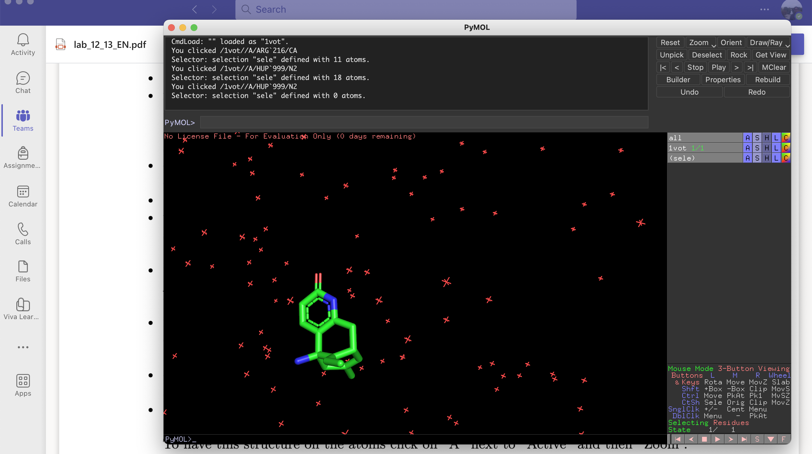
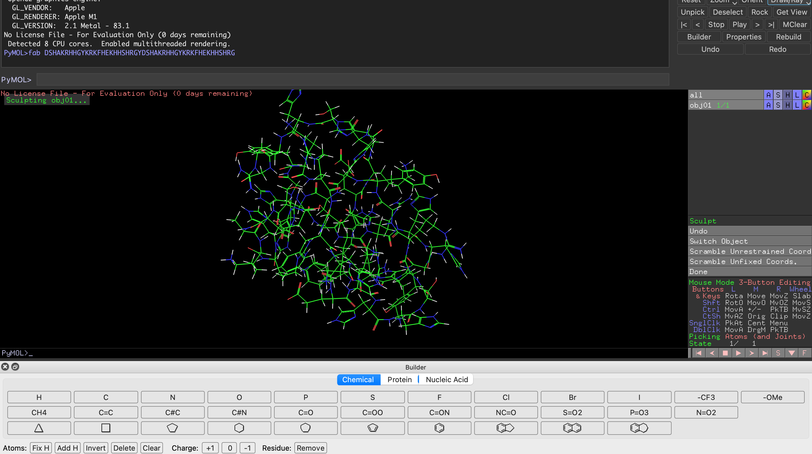
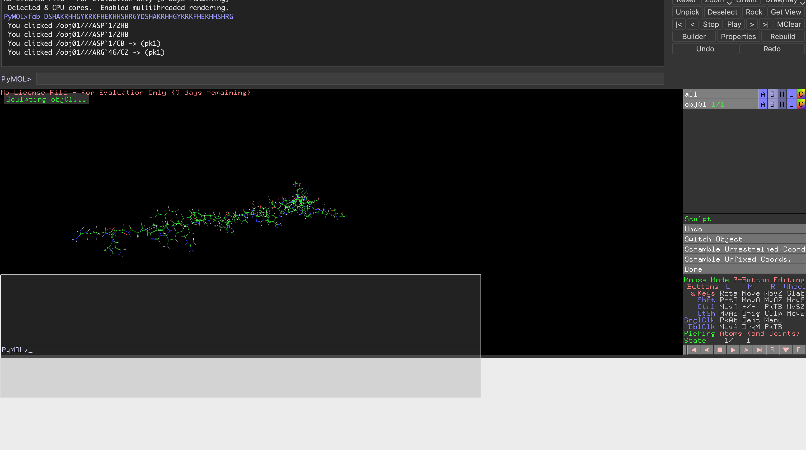
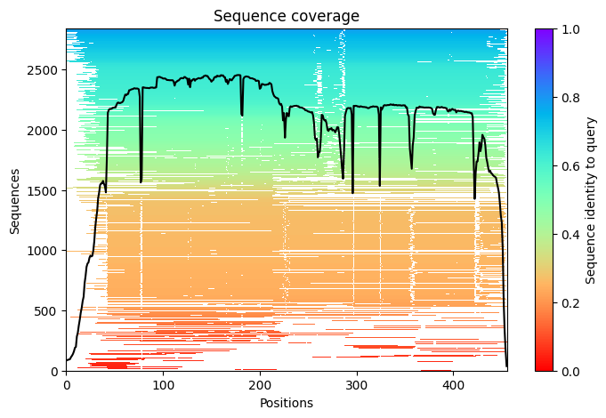
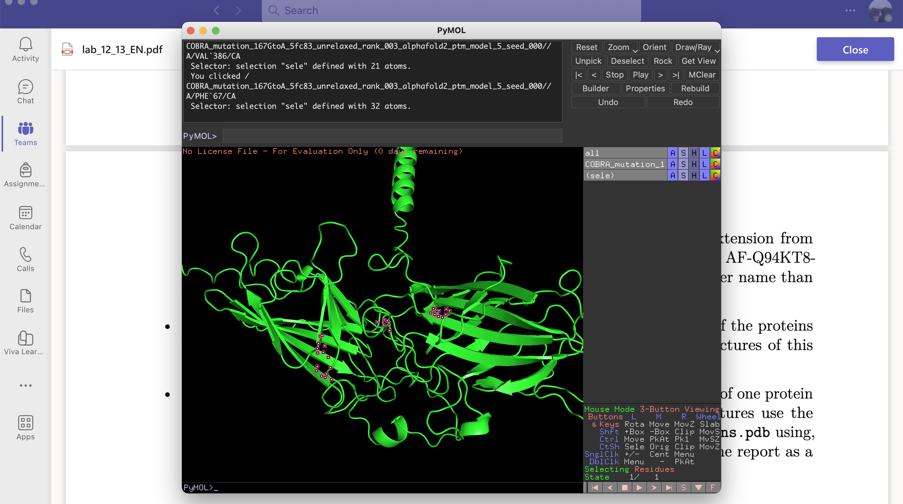

## TASK-1


## TASK2

 Executive: Colored 10 atoms. Executive: Colored 44 atoms.

## TASK3
not sure what the diffrece it can make though

## TASK4

## TASK5
12

## TASK6

2

## TASK7
--

## TASK8

## TASK9
YES, IT FOLDED.

## TASK10

## TASK11

 PyMOL(TM) 2.5.5 - Incentive Product Copyright (C) Schrodinger, LLC  This Executable Build integrates and extends Open-Source PyMOL. Detected OpenGL version 2.1. Shaders available. Detected GLSL version 1.20. OpenGL graphics engine:  GL_VENDOR:   Apple  GL_RENDERER: Apple M1  GL_VERSION:  2.1 Metal - 83.1No License File - For Evaluation Only (0 days remaining)
 Detected 8 CPU cores.  Enabled multithreaded rendering.

## Task12
>sp|Q94KT8|COBRA_ARATH Protein COBRA OS=Arabidopsis thaliana OX=3702 GN=COB PE=2 SV=1
MESFFSRSTSIVSKLSFLALWIVFLISSSSFTSTEAYDALDPEGNITMKWDVMSWTPDGY
VAVVTMFNFQKYRHIQSPGWTLGWKWAKKEVIWSMVGAQTTEQGDCSKYKGNIPHCCKKD
PTVVDLLPGTPYNQQIANCCKGGVMNSWVQDPATAASSFQISVGAAGTTNKTVRVPRNFT
LMGPGPGYTCGPAKIVRPTKFVTTDTRRTTQAMMTWNITCTYSQFLAQRTPTCCVSLSSF
YNETIVGCPTCACGCQNNRTESGACLDPDTPHLASVVSPPTKKGTVLPPLVQCTRHMCPI
RVHWHVKQNYKEYWRVKITITNFNYRLNYTQWNLVAQHPNLDNITQIFSFNYKSLTPYAG
LNDTAMLWGVKFYNDFLSEAGPLGNVQSEILFRKDQSTFTFEKGWAFPRRIYFNGDNCVM
PPPDSYPFLPNGGSRSQFSFVAAVLLPLLVFFFFSA

## TASK13

## Task14

The code performs a protein structure prediction using the AlphaFold model, it will generate graphs showing the multiple sequence alignment (MSA) and the predicted protein structure.

## TASK15

##  Task16

